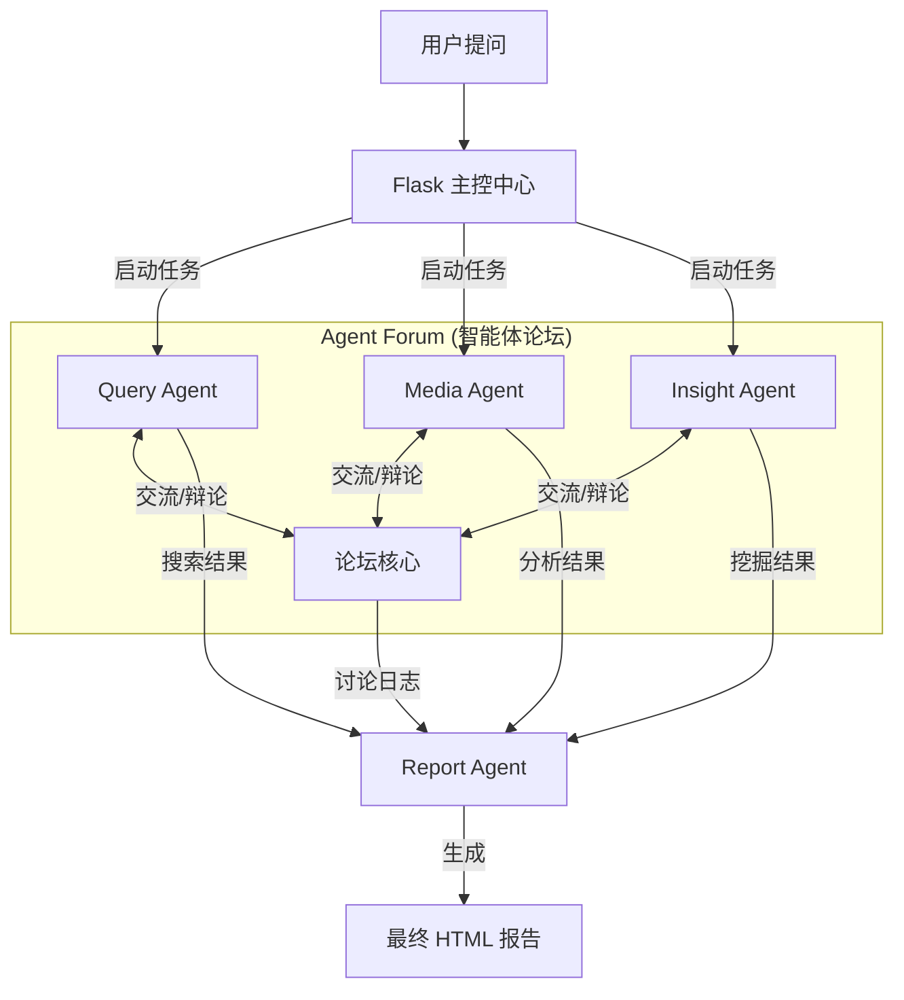

<div align="center">


# GhostSense (微舆) - 智能多智能体舆情分析系统

[](LICENSE)
[](https://github.com/666ghj/BettaFish)
[](https://hub.docker.com/)
[](https://www.python.org/)

[English](./README-EN.md) | [中文文档](./README.md)

</div>

## 📖 项目介绍

**GhostSense (微舆)** 是一个创新型的多智能体（Multi-Agent）舆情分析系统。它打破了传统舆情监测的被动模式，通过模拟人类专家的协作机制，实现了从全网数据采集、深度分析到专业报告生成的全流程自动化。

系统核心在于其独特的 **"Agent Forum" (智能体论坛)** 机制：不同的专业智能体（搜索、多模态、内部分析）在论坛中像人类专家一样进行辩论、协作和思维碰撞，从而产生比单一模型更深入、更客观的分析结果。

## ✨ 核心特性

### 1. 多智能体协同 ("Agent Forum")
引入辩论主持人机制，各垂直领域 Agent 在 "论坛" 中实时交互。
- **协作**：共享发现的信息和线索。
- **辩论**：对同一事件的不同视角进行交叉验证。
- **反思**：基于讨论结果动态调整分析策略。

### 2. 四大核心引擎
系统由四个高度专业化的智能体引擎组成：

- **🔍 Query Engine (广度搜索)**
  - 基于 **Tavily API** 的全球新闻搜索。
  - 负责广泛收集互联网公开信息，覆盖主流新闻源。
  - 具备自我反思能力，自动优化搜索关键词。

- **🎬 Media Engine (多模态分析)**
  - 基于 **Bocha API** 的多模态理解能力。
  - 能够解析图片、视频描述等多媒体内容。
  - 挖掘短视频平台（抖音、快手）和社交媒体中的非文本舆情。

- **🧠 Insight Engine (深度挖掘)**
  - 专注于 **私有/本地数据库** 的深度挖掘。
  - 集成 **MindSpider** 爬虫数据，分析海量用户评论。
  - 内置 **多语言情感分析模型** (BERT/Qwen微调)，精准捕捉公众情绪。

- **📝 Report Engine (智能报告)**
  - 汇总各 Agent 的分析成果及论坛讨论记录。
  - 智能选择最佳报告模板（社会热点、品牌监测等）。
  - 自动生成图文并茂的 HTML 深度分析报告。

### 3. 强大的数据采集 (MindSpider)
内置 Python 编写的高性能爬虫系统 `MindSpider`：
- 7x24 小时监控微博、小红书、抖音等主流平台。
- 支持话题提取、深度评论抓取。
- 自动存入数据库供 Insight Engine 调用。

## 🏗️ 系统架构



## 🚀 快速开始

### 方式一：Docker 部署（推荐）

1. **克隆仓库**
   ```bash
   git clone https://github.com/666ghj/BettaFish.git
   cd BettaFish
   ```

2. **配置环境变量**
   复制 `.env.example` 为 `.env`，并填入必要的 API Key（Tavily, Bocha, LLM 等）。
   ```bash
   cp .env.example .env
   ```

3. **启动服务**
   ```bash
   docker compose up -d
   ```
   访问 `http://localhost:5000` 即可使用。

### 方式二：源码运行

#### 环境要求
- Python 3.9+
- PostgreSQL / MySQL
- Chrome/Chromium (用于 Playwright 爬虫)

#### 1. 安装依赖
```bash
# 推荐使用 conda 或 uv 管理环境
conda create -n ghostsense python=3.11
conda activate ghostsense

pip install -r requirements.txt
playwright install chromium
```

#### 2. 配置数据库与 API
修改 `.env` 文件，配置数据库连接信息和 LLM API Key。
```ini
# 数据库配置
DB_HOST=localhost
DB_PORT=5432
DB_USER=ghostsense
DB_PASSWORD=ghostsense
DB_NAME=ghostsense

# LLM 配置 (支持 OpenAI 格式)
INSIGHT_ENGINE_API_KEY=sk-...
...
```

#### 3. 启动系统
```bash
python app.py
```
系统将启动 Flask 后端及所有 Streamlit 子应用。

## 🛠️ 模块化使用

除了全系统运行，您也可以单独运行某个引擎：

- **启动 Query Engine UI**:
  ```bash
  streamlit run SingleEngineApp/query_engine_streamlit_app.py --server.port 8503
  ```

- **启动爬虫 (MindSpider)**:
  ```bash
  cd MindSpider
  python main.py --broad-topic  # 抓取热点
  python main.py --deep-sentiment --platforms xhs wb  # 深度抓取
  ```

## 📂 目录结构

```
GhostSense/
├── app.py                  # Flask 主入口
├── QueryEngine/            # 广度搜索智能体
├── MediaEngine/            # 多模态智能体
├── InsightEngine/          # 深度挖掘智能体
├── ReportEngine/           # 报告生成智能体
├── ForumEngine/            # 论坛交互核心
├── MindSpider/             # 数据采集爬虫
├── SentimentAnalysisModel/ # 情感分析模型库
├── SingleEngineApp/        # 独立运行的 Streamlit 应用
├── templates/              # Web 前端模板
├── static/                 # 静态资源
└── final_reports/          # 生成的分析报告
```

## ⚠️ 免责声明

1. **仅供学习研究**：本项目仅供学术研究和技术学习使用，严禁用于任何非法用途。
2. **数据合规**：使用爬虫功能时，请严格遵守目标网站的 `robots.txt` 协议及相关法律法规。
3. **内容安全**：分析报告由 AI 生成，不代表项目组观点，请对结果进行人工核实。

## 🤝 贡献与支持

欢迎提交 Issue 和 Pull Request！

- **项目主页**: [GitHub](https://github.com/666ghj/BettaFish)
- **问题反馈**: [Issues](https://github.com/666ghj/BettaFish/issues)
- **联系邮箱**: hangjiang@bupt.edu.cn

## 🙏 致谢

本项目在开发过程中参考和引用了以下优秀的开源项目：

- **[BettaFish](https://github.com/666ghj/BettaFish)**: 本项目基于 BettaFish 进行二次开发和改进。
- **[MediaCrawler](https://github.com/NanmiCoder/MediaCrawler)**: 爬虫模块 (MindSpider) 的核心实现参考了 MediaCrawler 的设计。

感谢以上开源项目的作者和贡献者！

## 📄 许可证

本项目采用 [GPL-2.0 许可证](LICENSE)。
